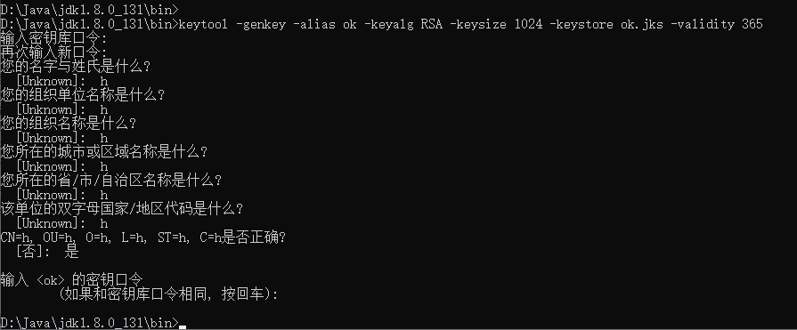

## Welcome to liuyaguang  note

### HTTPS 和 HTTP 区别 ?
① https://blog.csdn.net/xiaoming100001/article/details/81109617
② 使用keytool生成证书
    keytool -genkey -alias test -keyalg RSA -keysize 1024 -keystore test.jks -validity 365
    利用"keytool -list -v -keystore test.jks"查看JKS中生成的证书的详细信息
    利用“keytool -alias test -exportcert -keystore test.jks -file test.cer”，导出证书，并可以双击打开证书查看证书信息
    keytool -genkey -alias tomcat -storetype PKCS12 -keyalg RSA -keysize 2048 -keystore keystore.p12 -validity 3650
        -startdate 2020-05-01
    keytool -genkey -alias okk -keyalg RSA -keysize 1024 -keystore okk.jks -validity 365
    123456

